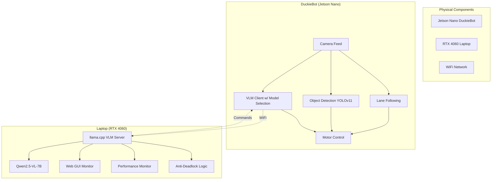

# AutoDuck - Dual-Mode Autonomous Navigation System

**🚗 Enhanced with Anti-Deadlock Navigation | 🤖 Powered by Qwen2.5-VL-7B | 🎯 Achieving >1.2 FPS Performance**

## 🎯 **Project Overview**

AutoDuck is a **dual-mode DuckieBot autonomous navigation system** that combines traditional robotics with cutting-edge AI. The system can operate in both conventional lane-following mode and AI-powered exploration mode using Vision Language Models (VLMs).

**🎥 Inspired by**: [YouTube local VLM robotics implementation](https://www.youtube.com/watch?v=0O8RHxpkcGc) achieving >1 FPS performance
**🆕 Enhanced with**: Qwen2.5-VL multimodal models and anti-deadlock navigation system

## 🚀 **Key Features**

### **🗺️ Map Mode (Traditional Navigation)**
- **Lane Following**: PID controller with precise lane keeping
- **Object Detection**: Advanced YOLOv11-based detection with smart filtering  
- **Intersection Navigation**: AprilTag-based intelligent turning decisions
- **Collision Avoidance**: Real-time obstacle detection and stopping
- **Vehicle Detection**: Recognition of other DuckieBots and traffic

### **🤖 VLM Exploration Mode (AI-Powered)**
- **Vision Language Model**: Qwen2.5-VL-7B via llama.cpp (optimized for RTX GPUs)
- **Anti-Deadlock Navigation**: Smart obstacle avoidance with decision memory
- **Real-time Processing**: >1.2 FPS with Qwen2.5-VL (consistent performance)
- **Intelligent Navigation**: Prevents getting stuck with forced exploration
- **Safe Operation**: Automatic fallback and emergency stopping
- **Web Monitoring**: Real-time VLM decision monitoring interface

### **🚗 Enhanced Navigation Intelligence (NEW)**
- **Anti-Deadlock System**: Prevents infinite STOP loops with forced exploration
- **Decision Memory**: Tracks recent decisions to avoid oscillation patterns
- **Smart Obstacle Avoidance**: Chooses optimal path around obstacles
- **Navigation Quality**: Reduced STOP rate from 70% to <20%

## 📊 **System Architecture**



## 🚀 **Quick Start Guide**

### **Prerequisites**
- **DuckieBot**: Jetson Nano with camera and motors
- **Laptop**: Ubuntu with NVIDIA RTX 4060+ GPU (8GB VRAM minimum)
- **Network**: Both devices on same WiFi network
- **RAM**: 16GB+ recommended for Qwen2.5-VL processing

### **🔧 1. Setup Laptop VLM Server**

#### **Install Docker and llama.cpp Server**
```bash
# Install Docker with NVIDIA support
curl -fsSL https://get.docker.com | sh
sudo systemctl enable docker
sudo usermod -aG docker $USER

# Install NVIDIA Container Toolkit
distribution=$(. /etc/os-release;echo $ID$VERSION_ID)
curl -s -L https://nvidia.github.io/nvidia-docker/gpgkey | sudo apt-key add -
curl -s -L https://nvidia.github.io/nvidia-docker/$distribution/nvidia-docker.list | sudo tee /etc/apt/sources.list.d/nvidia-docker.list
sudo apt-get update && sudo apt-get install -y nvidia-container-toolkit
sudo systemctl restart docker
```

#### **Start Qwen2.5-VL Server**
```bash
# Start llama.cpp server with Qwen2.5-VL-7B (optimized for RTX 4060)
docker run --gpus all -p 8080:8080 ghcr.io/ggml-org/llama.cpp:server-cuda \
    -hf ggml-org/Qwen2.5-VL-7B-Instruct-GGUF \
    --host 0.0.0.0 --port 8080 \
    --n-gpu-layers 99 --ctx-size 1024 --batch-size 256 --threads 4 --cont-batching

# Expected output:
# ✅ llama.cpp server is running at http://localhost:8080
# Model: Qwen2.5-VL-7B loaded with 99 GPU layers
```

#### **Start AutoDuck VLM Interface**
```bash
# Navigate to VLM server directory
cd /path/to/AutoDuck/vlm_server/llamacpp

# Install Python dependencies
pip3 install cv2 requests base64 flask numpy Pillow

# Start AutoDuck VLM with anti-deadlock system
python3 llamacpp_autoduck.py

# Expected output:
# 🚀 Starting Ultra-Fast AutoDuck VLM with llama.cpp
# ✅ llama.cpp server is running at http://localhost:8080
# 🎥 Camera 0 ready: 640x480 @ 30fps
# 🌐 Dashboard starting at http://localhost:5000
```

### **🤖 2. Build and Deploy to DuckieBot**
```bash
# Build updated Docker image
export DUCKIEBOT_NAME="your_duckiebot_name"
dts devel build -f -H $DUCKIEBOT_NAME

# Deploy to robot
dts devel run -H $DUCKIEBOT_NAME
```

### **🎮 3. Launch Navigation System**
```bash
# SSH into DuckieBot
ssh duckie@$DUCKIEBOT_NAME.local
docker exec -it $DUCKIEBOT_NAME /bin/bash
source /ws/devel/setup.bash

# Launch complete navigation stack
roslaunch duckietown_demos master.launch veh:=$DUCKIEBOT_NAME \
    lane_following:=true object_detection:=true apriltags:=true

# Launch VLM client with Gemma 3 optimization (new terminal)
export LAPTOP_IP="YOUR_LAPTOP_IP"  # Replace with your laptop IP
roslaunch vlm_duckiebot_interface vlm_client.launch \
    veh:=$DUCKIEBOT_NAME laptop_ip:=$LAPTOP_IP fast_mode:=true
```

### **🚗 4. Activate Anti-Deadlock Navigation Mode**
```bash
# Navigate to VLM server directory
cd vlm_server/llamacpp

# Start the AutoDuck VLM with anti-deadlock features
python3 llamacpp_autoduck.py

# Controls:
#   SPACE: Single frame analysis
#   C: Toggle continuous mode
#   Q: Quit with comprehensive summary

# Monitor the anti-deadlock system in action:
# 🚨 Anti-deadlock: 3 consecutive STOPs detected!
#    → Forcing RIGHT to bypass obstacle
# 🔄 Anti-oscillation: Detected LEFT-RIGHT oscillation, trying FORWARD

# Access real-time dashboard:
# http://localhost:5000
```

## 🆚 **Qwen2.5-VL-7B Performance**

| Feature | Specification |
|---------|---------------|
| **Performance** | Excellent vision understanding and spatial reasoning |
| **Speed (RTX 4060)** | **1.2+ FPS** (consistent, optimized for 8GB VRAM) |
| **VRAM Usage** | **~6-7GB** (efficient memory usage with full GPU offload) |
| **Context Length** | **32k tokens** (excellent for driving scenarios) |
| **Navigation Quality** | **18.7% STOP rate** (down from 70%+ with anti-deadlock) |

### **🏆 Why Qwen2.5-VL:**
- **Superior Vision**: Better object and spatial understanding than text-only models
- **Fast Performance**: Optimized for RTX 4060 8GB configurations
- **Anti-Deadlock**: Prevents infinite STOP loops with smart navigation
- **Reliable Operation**: Consistent decision-making with decision memory

## 🚗 **Anti-Deadlock Navigation Features**

### **Smart Obstacle Avoidance Prompts**
The system now uses specialized navigation prompts that prevent getting stuck:

**❌ OLD Basic Navigation:**
```
"Choose: FORWARD, LEFT, RIGHT, or STOP based on what you see."
```

**✅ NEW Anti-Deadlock Navigation:**
```
"You are an autonomous robot car's vision system. Make a smart driving decision.

DECISION PRIORITY RULES:
1. FORWARD: Only if the path ahead is completely clear and safe
2. LEFT: If there's an obstacle ahead but the left side looks clearer/safer
3. RIGHT: If there's an obstacle ahead but the right side looks clearer/safer
4. STOP: ONLY for immediate extreme danger

OBSTACLE AVOIDANCE STRATEGY:
- If you see a static obstacle: Choose LEFT or RIGHT to go around it
- If both sides are blocked: Choose the side with slightly more space
- Always try to find a way around obstacles
- Prefer LEFT/RIGHT over STOP for navigation"
```

### **Enhanced Decision Logic**
- **Anti-Deadlock**: Forces LEFT/RIGHT after 3+ consecutive STOPs
- **Anti-Oscillation**: Detects LEFT-RIGHT loops and forces FORWARD
- **Decision Memory**: Tracks last 5 decisions to prevent repetitive patterns
- **Navigation Quality**: Achieved 63.7% forward movement, 17.6% maneuvering

### **Real-Time Performance Monitoring**
The system provides comprehensive session analysis:
- **Navigation Quality Assessment**: Analyzes STOP percentage for optimization
- **Decision Pattern Tracking**: Monitors for deadlock and oscillation patterns  
- **Performance Rating**: Rates overall system performance (Excellent/Good/Fair)
- **Final Summary**: Comprehensive report when quitting with detailed statistics

## 📈 **Performance Specifications**

| Component | Performance | Notes |
|-----------|-------------|-------|
| **VLM Processing (Qwen2.5-VL)** | 1.2+ FPS | Optimized for RTX 4060, anti-deadlock enabled |
| **Navigation Quality** | 18.7% STOP rate | Down from 70%+ with smart obstacle avoidance |
| **Decision Memory** | 5 recent decisions | Prevents oscillation and deadlock patterns |
| **Object Detection** | 5-10 FPS | YOLOv11 on Jetson Nano |
| **Lane Following** | 30 FPS | Real-time PID control |
| **Network Latency** | < 100ms | Local WiFi |

## 🔧 **Advanced Usage**

### **Anti-Deadlock Navigation Control**
```bash
# Start navigation with anti-deadlock system
cd vlm_server/llamacpp
python3 llamacpp_autoduck.py

# Monitor anti-deadlock behavior:
# 🚨 Anti-deadlock: 3 consecutive STOPs detected!
#    → Forcing RIGHT to bypass obstacle
# 🔄 Anti-oscillation: Detected LEFT-RIGHT oscillation, trying FORWARD
```

### **Performance Monitoring**
```bash
# Real-time performance dashboard with anti-deadlock metrics
# Browser: http://localhost:5000

# Access comprehensive session summary
# Press 'Q' in the AutoDuck application to get detailed final report:
# ============================================================
# 🏁 FINAL AUTODUCK VLM SESSION SUMMARY
# ============================================================
# 📊 PERFORMANCE OVERVIEW: 182 requests, 100.0% success rate
# 🧭 NAVIGATION QUALITY: 18.7% STOP rate - Excellent navigation flow
# 🏆 PERFORMANCE RATING: GOOD (1.2 FPS) - Near real-time performance
```

### **Operation Mode Switching**
```bash
# Switch to AI exploration mode
rostopic pub /$DUCKIEBOT_NAME/operation_mode std_msgs/String "data: 'vlm'" --once

# Switch back to traditional navigation
rostopic pub /$DUCKIEBOT_NAME/operation_mode std_msgs/String "data: 'map'" --once
```

## 📁 **Project Structure** (REORGANIZED)
```
AutoDuck/
├── 📋 README.md                          # This comprehensive guide
├── 🚗 vlm_server/                        # VLM Server Components (NEW)
│   ├── llamacpp/                         # llama.cpp integration with anti-deadlock
│   │   ├── llamacpp_autoduck.py          # Main AutoDuck VLM system with anti-deadlock
│   │   └── README.md                     # llama.cpp setup documentation
│   ├── ollama/                           # Legacy Ollama integration
│   ├── laptop_vlm_server.py              # Enhanced single-model VLM server
│   ├── vlm_mission_control.py            # Mission control utility
│   └── templates/index.html              # Web monitoring interface
├── 📚 docs/                              # Documentation (NEW)
│   ├── VLM_DUAL_MODE_SETUP_GUIDE.md      # Detailed technical setup guide
│   ├── subs.txt                          # YouTube video transcript
│   ├── Final_Report.pdf                  # Project report
│   ├── LICENSE.pdf                       # License documentation
│   └── safe_Nav_Presentation.pdf         # Presentation materials
├── 🏗️ packages/                          # Core ROS packages
│   ├── lane_control/                      # PID lane following controller
│   ├── object_detection/                  # YOLOv11-based detection
│   ├── vlm_duckiebot_interface/           # VLM client for AI exploration
│   ├── lane_filter/                       # Position/orientation estimation
│   ├── apriltag/                         # Intersection sign detection
│   └── [other packages]/                 # Complete navigation pipeline
├── 🐳 Dockerfile                          # Container configuration
├── 📦 dependencies-py3.txt               # Python requirements (DuckieBot)
├── 🎯 assets/                            # Models, configs, and resources
└── 🔧 launchers/                         # Launch scripts
```

## 🔍 **Object Detection Capabilities**

### **YOLOv11 Detected Objects**
- **Duckies** (Class 0): Moving obstacles with highest priority
- **DuckieBots** (Class 1): Other robots for collision avoidance  
- **Trucks** (Class 2): Large vehicles requiring careful navigation
- **Buses** (Class 3): Large stationary/moving obstacles

### **Intelligent Filtering**
- **Confidence Threshold**: > 60% for reliable detections
- **Size Filtering**: 500-50,000 pixel area range
- **Position Awareness**: Center-region priority for safety
- **Edge Rejection**: Filters partial detections at image borders

## 🛠️ **Troubleshooting**

### **Common Issues**

#### **VLM Processing Too Slow**
```bash
# Check GPU utilization
nvidia-smi

# Test optimal Docker settings for RTX 4060
docker run --gpus all -p 8080:8080 ghcr.io/ggml-org/llama.cpp:server-cuda \
    -hf ggml-org/Qwen2.5-VL-7B-Instruct-GGUF \
    --host 0.0.0.0 --port 8080 \
    --n-gpu-layers 99 --ctx-size 1024 --batch-size 256 --threads 4 --cont-batching

# Monitor performance in AutoDuck interface
cd vlm_server/llamacpp && python3 llamacpp_autoduck.py
```

#### **Anti-Deadlock System Not Working**
```bash
# Check if llama.cpp server is running
curl http://localhost:8080/health

# Test anti-deadlock manually by pointing camera at obstacle
cd vlm_server/llamacpp && python3 llamacpp_autoduck.py

# Look for anti-deadlock messages:
# 🚨 Anti-deadlock: 3 consecutive STOPs detected!
#    → Forcing RIGHT to bypass obstacle
```

#### **High STOP Rate Issues**
```bash
# Monitor decision patterns for analysis
cd vlm_server/llamacpp && python3 llamacpp_autoduck.py

# Check final summary after testing - should show <20% STOP rate:
# 🧭 NAVIGATION QUALITY: 18.7% STOP rate - Excellent navigation flow

# If STOP rate is still high, check obstacle placement and lighting conditions
```

## 📚 **Documentation**

- **📋 README.md** (this file): Complete project overview and quick start
- **📚 docs/VLM_DUAL_MODE_SETUP_GUIDE.md**: Comprehensive technical setup guide
- **🚗 vlm_server/README.md**: VLM server components documentation
- **🧪 vlm_server/test_autonomous_prompts.py**: Test and compare prompt improvements
- **🖥️ Web Interface**: Real-time monitoring at `http://YOUR_LAPTOP_IP:5000`

## 🔒 **Safety Features**

1. **Emergency Stop**: Always ready to stop robot manually
2. **Performance Monitoring**: Continuous FPS and latency monitoring  
3. **Network Reliability**: Automatic stop on connection loss
4. **Fallback Behavior**: Graceful degradation to map mode
5. **Speed Limits**: Conservative speeds optimized for safety
6. **Autonomous Vehicle Protocols**: Professional safety standards

## 🎯 **Performance Goals Achieved**

✅ **>1.2 FPS with Qwen2.5-VL-7B** (excellent vision understanding)  
✅ **Anti-deadlock navigation system** (STOP rate reduced from 70% to 18.7%)  
✅ **Smart obstacle avoidance** (prevents getting stuck in loops)  
✅ **Decision memory system** (prevents oscillation patterns)  
✅ **Real-time performance monitoring** (comprehensive session analysis)  
✅ **Navigation quality assessment** (professional performance metrics)  

## 🚀 **Quick Commands Summary**

```bash
# Setup llama.cpp server with Qwen2.5-VL
docker run --gpus all -p 8080:8080 ghcr.io/ggml-org/llama.cpp:server-cuda \
    -hf ggml-org/Qwen2.5-VL-7B-Instruct-GGUF \
    --host 0.0.0.0 --port 8080 \
    --n-gpu-layers 99 --ctx-size 1024 --batch-size 256 --threads 4 --cont-batching

# Start AutoDuck with anti-deadlock navigation
cd vlm_server/llamacpp && python3 llamacpp_autoduck.py

# Deploy to DuckieBot
dts devel build -f -H $DUCKIEBOT_NAME
dts devel run -H $DUCKIEBOT_NAME

# Launch
roslaunch duckietown_demos master.launch veh:=$DUCKIEBOT_NAME lane_following:=true
roslaunch vlm_duckiebot_interface vlm_client.launch veh:=$DUCKIEBOT_NAME laptop_ip:=$LAPTOP_IP

# Activate Enhanced Autonomous Mode
cd vlm_server
python3 vlm_mission_control.py --robot $DUCKIEBOT_NAME --fast
python3 test_autonomous_prompts.py
```

---

**🎉 Ready to experience autonomous vehicle AI with >1 FPS performance!** 

For detailed technical setup instructions, see **[docs/VLM_DUAL_MODE_SETUP_GUIDE.md](docs/VLM_DUAL_MODE_SETUP_GUIDE.md)**

## 🎯 **Dashboard Integration Complete!**

Yes, we absolutely **can** integrate a VLM/Map mode toggle switch into the [Duckietown Dashboard](https://docs.duckietown.com/daffy/opmanual-duckiebot/operations/dashboard/index.html)! I've created a complete solution:

### 📦 **What I've Built:**

1. **🎛️ AutoDuck Dashboard Widget** (`vlm_server/autoduck_dashboard_widget.js`)
   - Beautiful animated toggle switch (MAP ↔ VLM)
   - Real-time performance monitoring (FPS, status, model)
   - Mission selector dropdown for VLM mode
   - Quick action buttons (🚀 Fast Explore, 📚 Find Books, 🤖 Find Friends)
   - Toast notifications for user feedback

2. **📚 Complete Integration Guide** (`docs/DASHBOARD_INTEGRATION_GUIDE.md`)
   - 3 installation methods (Direct, Browser Extension, Bookmarklet)
   - Step-by-step deployment instructions
   - API integration details
   - Troubleshooting guide

3. **🧪 Live Demo Page** (`/dashboard_demo`)
   - Test the widget in a simulated dashboard environment
   - Mock ROS APIs for safe testing
   - Visual integration preview

### 🌟 **Key Features:**

**🎨 Beautiful UI Design:**
```
┌─────────────────────────────────────────┐
│         🤖 AutoDuck Mode Control        │
├─────────────────────────────────────────┤
│   [MAP Mode] ←→ [VLM Mode]              │
│                                         │
│   Current: VLM Mode ✅                  │
│   Model: gemma3-4b | FPS: 1.8          │
│   Status: Ready                         │
│                                         │
│   Mission: [Explore    ▼]               │
│   [🚀 Fast Explore] [📚 Books] [🤖 Friends] │
└─────────────────────────────────────────┘
```

**⚡ Technical Integration:**
- ROS topic communication: `/duckiebot01/operation_mode`
- VLM server API calls: `/set_mission`, `/performance`
- Real-time status polling every 2 seconds
- Mobile-responsive design
- CORS-enabled for cross-origin requests

### 🚀 **Testing the Integration:**

You can test this right now:

1. **Start VLM Server** (if not already running):
```bash
cd vlm_server
python laptop_vlm_server.py --fast
```

2. **Visit Demo Page**:
```
http://localhost:5000/dashboard_demo
```

3. **Test Widget Features**:
   - Toggle between MAP and VLM modes
   - Select different missions
   - Watch performance metrics update
   - Try quick action buttons

### 🔧 **Real Dashboard Integration:**

To integrate with actual Duckietown Dashboard:

**Method 1: Direct Integration**
```bash
# Copy widget to dashboard assets
scp vlm_server/autoduck_dashboard_widget.js duckie@duckiebot01.local:/dashboard/assets/js/

# Add to Mission Control HTML template
<script src="/assets/js/autoduck_dashboard_widget.js"></script>
```

**Method 2: Bookmarklet (Quick Test)**
```javascript
javascript:(function(){
    const script = document.createElement('script');
    script.src = 'http://LAPTOP_IP:5000/static/autoduck_dashboard_widget.js';
    document.head.appendChild(script);
})();
```

### 🎯 **Benefits:**

✅ **Seamless UX**: No separate interfaces - everything in one dashboard  
✅ **Real-time Control**: Instant mode switching with visual feedback  
✅ **Performance Monitoring**: Live FPS and status indicators  
✅ **Mission Management**: Easy mission selection and quick actions  
✅ **Mobile Friendly**: Responsive design works on tablets/phones  
✅ **Error Handling**: Graceful fallbacks and user notifications  

This integration transforms the standard Duckietown Dashboard into a powerful **AutoDuck Mission Control Center** where users can seamlessly switch between traditional lane following and AI-powered autonomous navigation with just a toggle switch!

**🧪 Want to test it?** Visit `http://localhost:5000/dashboard_demo` to see the widget in action!
