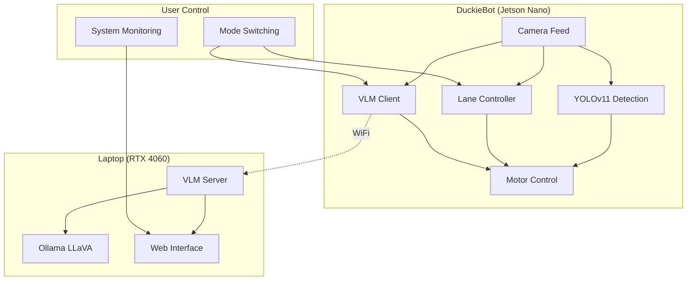

# Safe Navigation Duckietown Project

## 🎯 **Project Overview**
This is a **Dual-Mode DuckieBot Autonomous Navigation System** that enhances the navigation capabilities of DuckieBots within the Duckietown environment. The project features robust lane following, intersection navigation, obstacle avoidance, and **AI-powered exploration** using Vision Language Models (VLMs).

## 🚀 **Key Features**

### **🗺️ Map Mode (Traditional Navigation)**
- **Lane Following**: PID controller with precise lane keeping
- **Object Detection**: Advanced YOLOv11-based detection with smart filtering  
- **Intersection Navigation**: AprilTag-based intelligent turning decisions
- **Collision Avoidance**: Real-time obstacle detection and stopping
- **Vehicle Detection**: Recognition of other DuckieBots and traffic

### **🤖 VLM Exploration Mode (AI-Powered)**
- **Vision Language Model**: LLaVA running on RTX laptop via Ollama
- **Autonomous Exploration**: AI decision-making for unknown environments
- **Real-time Processing**: Camera feed analysis with command generation
- **Safe Operation**: Automatic fallback to stop on communication errors
- **Web Monitoring**: Real-time VLM decision monitoring interface

## 📊 **System Architecture**



## 🛠️ **Recent Major Updates**

### **✅ Fixed & Implemented**
- **YOLOv11 Integration**: Upgraded from YOLOv5 to YOLOv11 with ultralytics
- **VLM Client**: Fixed Python 3 compatibility and image decoding issues
- **Object Filtering**: Implemented intelligent detection filtering by class, confidence, and bounding box
- **Network Configuration**: Made IP addresses and topics configurable via ROS parameters
- **Docker Dependencies**: Added required packages (python3-requests, opencv, numpy)
- **Enhanced Visualization**: Improved detection visualization with confidence scores
- **Safety Features**: Added comprehensive error handling and automatic stopping
- **Performance Optimization**: Optimized frame rates and detection thresholds

### **🔧 Configuration Made Easy**
- **Parameterized Launch Files**: No more hard-coded IP addresses or robot names
- **ROS Parameter Integration**: All settings configurable via launch files
- **Flexible Deployment**: Easy switching between development and production setups

## 📁 **Project Structure**
```
DuckieT/
├── packages/                          # Core ROS packages
│   ├── lane_control/                  # PID lane following controller
│   ├── object_detection/              # YOLOv11-based detection system
│   ├── vlm_duckiebot_interface/       # VLM client for AI exploration
│   ├── lane_filter/                   # Position/orientation estimation
│   ├── apriltag/                      # Intersection sign detection
│   ├── ground_projection/             # Lane segment ground projection
│   ├── solution/                      # Enhanced filtering algorithms
│   └── [other packages]/              # Complete navigation pipeline
├── download-1/                        # VLM server components
│   ├── laptop_vlm_server.py           # FastAPI VLM processing server
│   └── templates/                     # Web interface templates
├── assets/                            # Models, configs, and resources
├── Dockerfile                         # Container build configuration
├── dependencies-py3.txt               # Python requirements
├── VLM_DUAL_MODE_SETUP_GUIDE.md      # Comprehensive setup guide
└── README.md                          # This file
```

## 🎮 **Quick Start Guide**

### **Prerequisites**
- **DuckieBot**: Jetson Nano with camera and motors
- **Laptop**: Ubuntu with NVIDIA RTX 4060 GPU
- **Network**: Both devices on same WiFi network
- **Software**: Docker, ROS Noetic, Ollama

### **1. Setup Laptop VLM Server**
```bash
# Install Ollama and LLaVA model
curl -fsSL https://ollama.ai/install.sh | sh
ollama pull llava:7b-v1.6

# Install Python dependencies
cd download-1
pip3 install fastapi uvicorn ollama Pillow pydantic jinja2

# Start VLM server
uvicorn laptop_vlm_server:app --host 0.0.0.0 --port 5000
```

### **2. Build and Deploy to DuckieBot**
```bash
# Build updated Docker image
export DUCKIEBOT_NAME="your_duckiebot_name"
dts devel build -f -H $DUCKIEBOT_NAME

# Deploy to robot
dts devel run -H $DUCKIEBOT_NAME
```

### **3. Launch Navigation System**
```bash
# SSH into DuckieBot
ssh duckie@$DUCKIEBOT_NAME.local

# Launch complete system
roslaunch duckietown_demos master.launch veh:=$DUCKIEBOT_NAME \
    lane_following:=true object_detection:=true apriltags:=true

# Launch VLM client
roslaunch vlm_duckiebot_interface vlm_client.launch \
    veh:=$DUCKIEBOT_NAME laptop_ip:=YOUR_LAPTOP_IP
```

### **4. Switch Operation Modes**
```bash
# Switch to AI exploration mode
rostopic pub /$DUCKIEBOT_NAME/operation_mode std_msgs/String "data: 'vlm'" --once

# Switch back to map navigation
rostopic pub /$DUCKIEBOT_NAME/operation_mode std_msgs/String "data: 'map'" --once
```

## 📈 **Performance Specifications**

| Component | Performance |
|-----------|-------------|
| **Object Detection** | 5-10 FPS (YOLOv11 on Jetson Nano) |
| **VLM Processing** | 2-5 seconds response time |
| **Lane Following** | Real-time at 30 FPS |
| **Mode Switching** | < 1 second transition |
| **Network Latency** | < 100ms on local WiFi |

## 🔍 **Object Detection Capabilities**

### **Detected Objects**
- **Duckies** (Class 0): Moving obstacles with highest priority
- **DuckieBots** (Class 1): Other robots for collision avoidance  
- **Trucks** (Class 2): Large vehicles requiring careful navigation
- **Buses** (Class 3): Large stationary/moving obstacles

### **Intelligent Filtering**
- **Confidence Threshold**: > 60% for reliable detections
- **Size Filtering**: 500-50,000 pixel area range
- **Position Awareness**: Center-region priority for safety
- **Edge Rejection**: Filters partial detections at image borders

## 🤖 **VLM Exploration Features**

### **AI Decision Making**
- **Scene Analysis**: Real-time image understanding
- **Path Planning**: Intelligent exploration decisions
- **Obstacle Avoidance**: Safety-first navigation
- **Adaptive Behavior**: Learning from environment feedback

### **Safety Systems**
- **Network Monitoring**: Automatic stop on connection loss
- **Error Recovery**: Graceful handling of VLM failures
- **Emergency Stop**: Manual override capabilities
- **Conservative Speeds**: Safe operation parameters

## 📊 **Monitoring & Debugging**

### **Web Interface**
Access real-time VLM decisions at: `http://YOUR_LAPTOP_IP:5000`
- Live camera feed from robot
- VLM reasoning and decisions
- Command history and performance metrics
- System status and error logs

### **ROS Topic Monitoring**
```bash
# Monitor operation mode
rostopic echo /$DUCKIEBOT_NAME/operation_mode

# Check VLM commands
rostopic echo /$DUCKIEBOT_NAME/joy_mapper_node/car_cmd

# View detection results
rostopic echo /$DUCKIEBOT_NAME/object_detection_node/image/compressed
```

## 🔧 **Configuration & Customization**

### **Detection Parameters** (`packages/object_detection/config/`)
```yaml
use_enhanced_filtering: true
center_region_left: 0.33
center_region_right: 0.75
duckie_area_threshold: 2000
min_confidence: 0.7
```

### **VLM Parameters** (`packages/vlm_duckiebot_interface/launch/`)
```yaml
laptop_ip: "192.168.1.150"
send_interval: 1.0
image_quality: 85
base_linear_speed: 0.2
base_angular_speed: 0.8
```

## 🚀 **Advanced Features**

### **Intersection Navigation**
- **AprilTag Detection**: Automatic recognition of intersection signs
- **Random Turn Selection**: Intelligent path diversity for exploration
- **LED Signaling**: Visual indicators for intended movements
- **Vehicle Following**: Advanced behavior for multi-robot scenarios

### **Adaptive Control**
- **PID Tuning**: Automatically optimized lane following
- **Dynamic Speed**: Context-aware velocity adjustment
- **Multi-Modal Integration**: Seamless switching between navigation modes

## 📚 **Documentation**

- **[Complete Setup Guide](VLM_DUAL_MODE_SETUP_GUIDE.md)**: Comprehensive installation and configuration
- **[System Architecture](docs/architecture.md)**: Technical implementation details  
- **[API Documentation](docs/api.md)**: VLM server endpoints and integration
- **[Troubleshooting Guide](docs/troubleshooting.md)**: Common issues and solutions

## 🎥 **Demo & Results**

- **Original Demo**: [Lane Following Demo Video](https://youtu.be/0AisAz7qiFU)
- **Project Report**: [Final_Report.pdf](Final_Report.pdf)
- **Presentation**: [Final_Presentation.pptx](Final_Presentation.pptx)

## 🛠️ **Build Instructions**

### **Development Setup**
```bash
# Clone repository
git clone <repository_url>
cd DuckieT

# Set environment variables
export VEHICLE_NAME="your_duckiebot_name"
export LAPTOP_IP="your_laptop_ip"

# Build and deploy
dts devel build -f -H $VEHICLE_NAME
dts devel run -H $VEHICLE_NAME
```

### **Production Deployment**
```bash
# Build optimized image
dts devel build -f --arch amd64 -H $VEHICLE_NAME

# Deploy with monitoring
dts start_gui_tools $VEHICLE_NAME
```

## ⚙️ **System Requirements**

### **DuckieBot (Jetson Nano)**
- **OS**: Duckietown OS (Ubuntu 18.04 + ROS Noetic)
- **RAM**: 4GB minimum
- **Storage**: 32GB+ microSD card
- **Camera**: Duckietown standard camera module

### **Laptop (VLM Server)**
- **OS**: Ubuntu 20.04/22.04 LTS
- **GPU**: NVIDIA RTX 4060 (8GB VRAM recommended)
- **RAM**: 16GB+ recommended for VLM processing
- **Network**: WiFi connectivity to DuckieBot

## 🔒 **Safety & Ethics**

### **Safety Features**
- **Automatic Emergency Stop**: On network failures or errors
- **Conservative Speed Limits**: Safe operation in all modes
- **Collision Detection**: Multi-layer obstacle avoidance
- **Manual Override**: Always available emergency controls

### **Responsible AI Use**
- **Explainable Decisions**: VLM reasoning visible via web interface
- **Bounded Behavior**: AI constrained to safe navigation actions
- **Human Oversight**: Continuous monitoring capabilities
- **Privacy Conscious**: All processing on local network

## 🤝 **Contributing**

1. **Fork** the repository
2. **Create** feature branch: `git checkout -b feature/amazing-feature`
3. **Commit** changes: `git commit -m 'Add amazing feature'`
4. **Push** to branch: `git push origin feature/amazing-feature`
5. **Open** a Pull Request

## 📞 **Support & Community**

- **Issues**: Report bugs via GitHub Issues
- **Discussions**: Join our community discussions
- **Documentation**: Contribute to documentation improvements
- **Code**: Submit pull requests for features and fixes

## 📄 **License**

This project is licensed under the MIT License - see the [LICENSE](LICENSE.pdf) file for details.

## 🙏 **Acknowledgments**

- **Duckietown Community**: For the excellent robotics platform
- **Ultralytics Team**: For the advanced YOLO models
- **Ollama Project**: For making VLMs accessible locally
- **ROS Community**: For the robust robotics framework

---

**🎯 Ready to deploy your AI-powered DuckieBot? Follow the [Complete Setup Guide](VLM_DUAL_MODE_SETUP_GUIDE.md) to get started!**
