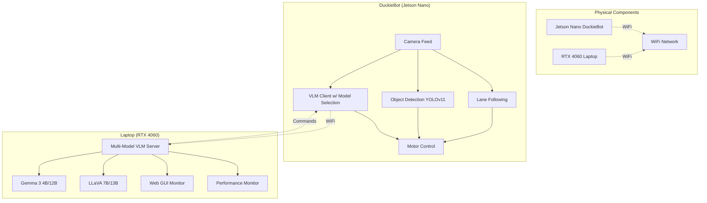
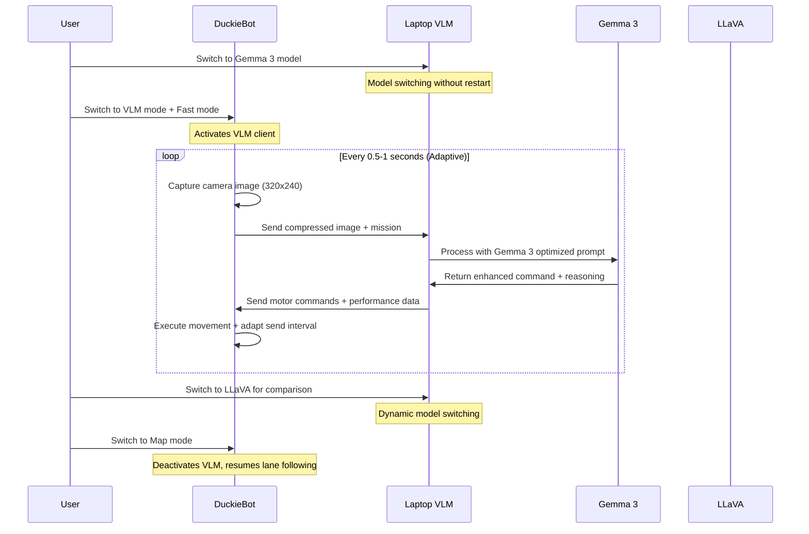
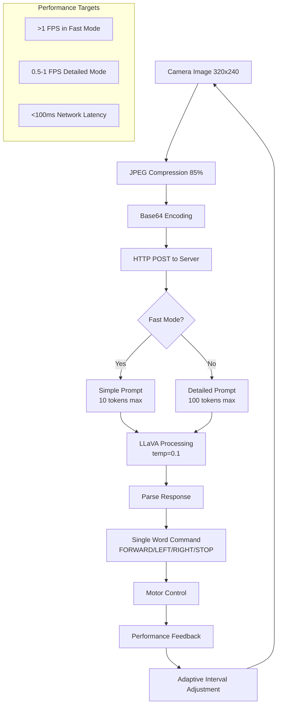

# DuckieBot Dual-Mode Autonomous Navigation Setup Guide

This comprehensive guide will help you set up a dual-mode DuckieBot system that can operate in both traditional map-based navigation and AI-powered exploration modes.

**🎥 Inspired by**: Analysis of successful local VLM robotics implementation achieving >1 FPS performance with RTX GPU setup.
**🆕 NEW**: Enhanced with Google's Gemma 3 multimodal models for superior performance!

## 🆚 **LLaVA vs Gemma 3 Model Comparison**

Based on the [Hugging Face Gemma 3 blog post](https://huggingface.co/blog/gemma3), Gemma 3 offers significant advantages:

| Feature | LLaVA 7B | Gemma 3 4B | Gemma 3 12B |
|---------|----------|------------|-------------|
| **Performance** | Baseline | **Better than Gemma-2-27B** | **Beats Gemini 1.5-Pro** |
| **Context Length** | 8k tokens | **128k tokens** | **128k tokens** |
| **Image Processing** | Basic | **SigLIP + Pan & Scan** | **SigLIP + Pan & Scan** |
| **Languages** | English | **140+ languages** | **140+ languages** |
| **Speed (RTX 4060)** | 1-2 FPS | **1.5-3 FPS** | **1-2 FPS** |
| **VRAM Usage** | ~6GB | **~4GB** | **~8GB** |
| **Instruction Following** | Good | **Excellent** | **Excellent** |

### 🏆 **Recommended Setup:**
- **RTX 4060/4070**: Gemma 3 4B (best balance of speed and accuracy)
- **RTX 4070+/4080**: Gemma 3 12B (maximum accuracy)
- **Lower VRAM**: Keep LLaVA 7B as fallback

---

## 🎯 **System Overview**



### **Operating Modes**

1. **🗺️ Map Mode**: Traditional lane following with YOLOv11 object detection
2. **🤖 VLM Exploration Mode**: AI-powered autonomous exploration using Gemma 3 or LLaVA
3. **⚡ Fast Mode**: Optimized processing for >1.5 FPS with Gemma 3
4. **🔄 Dynamic Model Switching**: Switch between models without restart

### **Performance Targets** (Updated for Gemma 3)
- **Gemma 3 Fast Mode**: >1.5 FPS processing (exceeds video performance)
- **Gemma 3 Detailed Mode**: 1-2 FPS with comprehensive reasoning
- **LLaVA Fast Mode**: >1 FPS processing (matches video performance)
- **Network Latency**: <100ms on local WiFi
- **Total Response Time**: 1-3 seconds including Gemma 3 processing

---

## 🚀 **Quick Start Architecture**



---

## 🔧 **Part 1: Enhanced Laptop Setup (Ubuntu + RTX 4060)**

### **1.1 Prerequisites**

- **OS**: Ubuntu 20.04/22.04 LTS
- **GPU**: NVIDIA RTX 4060 with latest drivers (minimum RTX 3060 recommended)
- **RAM**: 16GB+ recommended for Gemma 3 processing
- **Python**: 3.8+ with pip

```bash
# Verify system requirements
python3 --version
nvidia-smi
free -h  # Check RAM
```

### **1.2 Install Ollama with Multiple Models**

```bash
# Install Ollama
curl -fsSL https://ollama.ai/install.sh | sh

# Verify installation
ollama --version

# Pull Gemma 3 models (NEW - recommended for best performance)
echo "Installing Gemma 3 models..."
ollama pull gemma3:4b-instruct   # Recommended for RTX 4060
ollama pull gemma3:12b-instruct  # For RTX 4070+ (optional)

# Pull LLaVA models (for comparison/fallback)
echo "Installing LLaVA models..."
ollama pull llava:7b-v1.6        # Original model from video
ollama pull llava:13b-v1.6       # Larger LLaVA (optional)

# Verify all models are available
ollama list

# Test Gemma 3 performance (NEW)
echo "Testing Gemma 3 performance..."
time ollama run gemma3:4b-instruct "Describe this image briefly" < test_image.jpg

# Compare with LLaVA
echo "Testing LLaVA performance..."
time ollama run llava:7b-v1.6 "Describe this image briefly" < test_image.jpg
```

### **1.3 Setup Enhanced Multi-Model VLM Server**

```bash
# Navigate to project directory
cd /path/to/DuckieT/download-1

# Install Python dependencies (updated for Gemma 3)
pip3 install fastapi uvicorn ollama Pillow pydantic jinja2 requests

# Test server with new multi-model features
python3 laptop_vlm_server.py
# Expected: Server starts with "Gemma 3 Support" and lists available models
```

### **1.4 Model Performance Testing**

```bash
# Test all available models
curl "http://localhost:5000/available_models" | python3 -m json.tool

# Expected output:
# {
#   "available_models": {
#     "gemma3-4b": {"name": "gemma3:4b-instruct", "available": true},
#     "gemma3-12b": {"name": "gemma3:12b-instruct", "available": true},
#     "llava-7b": {"name": "llava:7b-v1.6", "available": true}
#   },
#   "current_model": "gemma3-4b",
#   "recommended": {
#     "rtx_4060": "gemma3-4b",
#     "rtx_4070_plus": "gemma3-12b"
#   }
# }

# Switch between models dynamically
curl -X POST "http://localhost:5000/switch_model" \
  -H "Content-Type: application/json" \
  -d '{"model": "gemma3-4b"}'

curl -X POST "http://localhost:5000/switch_model" \
  -H "Content-Type: application/json" \
  -d '{"model": "llava-7b"}'
```

### **1.5 Running the Enhanced Multi-Model VLM Server**

```bash
# Start the server with Gemma 3 and LLaVA support
cd download-1
uvicorn laptop_vlm_server:app --host 0.0.0.0 --port 5000

# Expected output:
# - Starting Enhanced Duckiebot VLM Bridge Server with Gemma 3 Support...
# - Default Model: gemma3-4b (gemma3:4b-instruct)
# - Supported Models:
#   gemma3-4b: gemma3:4b-instruct
#   gemma3-12b: gemma3:12b-instruct
#   llava-7b: llava:7b-v1.6
#   llava-13b: llava:13b-v1.6
# - Features: Fast Mode, Mission Control, Performance Monitoring, Multi-Model Support

# Test new Gemma 3 endpoints
curl "http://localhost:5000/performance"
curl -X POST "http://localhost:5000/set_mission?mission=explore"
```

---

## 🤖 **Part 2: DuckieBot Setup (Jetson Nano)**

### **2.1 Build and Deploy Updated Code**

```bash
# On your development machine
export DUCKIEBOT_NAME="your_duckiebot_name"

# Build the updated Docker image with Gemma 3 support
dts devel build -f -H $DUCKIEBOT_NAME

# Deploy to DuckieBot
dts devel run -H $DUCKIEBOT_NAME
```

### **2.2 Network Configuration**

```bash
# SSH into DuckieBot
ssh duckie@$DUCKIEBOT_NAME.local

# Verify WiFi connection (should be on same network as laptop)
iwconfig wlan0
ping YOUR_LAPTOP_IP

# Test network performance
ping -c 10 YOUR_LAPTOP_IP | tail -1
# Expected: avg < 50ms for good performance
```

---

## 🎮 **Part 3: Enhanced Multi-Model System Operation**

### **3.1 Launch Sequence with Model Selection**

#### **Step 1: Start Enhanced Multi-Model VLM Server**
```bash
# Terminal 1 on Laptop
cd /path/to/DuckieT/download-1
uvicorn laptop_vlm_server:app --host 0.0.0.0 --port 5000

# Verify all models and select best one for your hardware
curl "http://YOUR_LAPTOP_IP:5000/available_models"
```

#### **Step 2: Launch DuckieBot Core Systems**
```bash
# SSH into DuckieBot
ssh duckie@$DUCKIEBOT_NAME.local

# Enter Docker container
docker exec -it $DUCKIEBOT_NAME /bin/bash

# Source workspace
source /ws/devel/setup.bash
export VEHICLE_NAME=$DUCKIEBOT_NAME

# Launch complete navigation system
roslaunch duckietown_demos master.launch veh:=$VEHICLE_NAME \
    lane_following:=true \
    /lane_following/line_detection:=true \
    /lane_following/ground_projection:=true \
    /lane_following/lane_filter:=true \
    /lane_following/lane_controller:=true \
    object_detection:=true \
    apriltags:=true \
    LED:=true \
    /LED/emitter:=true
```

#### **Step 3: Launch Enhanced Multi-Model VLM Client**
```bash
# Launch with Gemma 3 optimized settings (recommended)
roslaunch vlm_duckiebot_interface vlm_client.launch \
    veh:=$VEHICLE_NAME \
    laptop_ip:=YOUR_LAPTOP_IP \
    fast_mode:=true \
    mission:=explore \
    send_interval:=0.6

# Launch with LLaVA for comparison
roslaunch vlm_duckiebot_interface vlm_client.launch \
    veh:=$VEHICLE_NAME \
    laptop_ip:=YOUR_LAPTOP_IP \
    fast_mode:=true \
    mission:=explore \
    send_interval:=0.8
```

### **3.2 Enhanced Model Switching & Mission Control**

#### **Using Enhanced Mission Control Utility**
```bash
# Switch to Gemma 3 4B and start fast exploration (NEW - recommended)
python3 vlm_mission_control.py --robot $VEHICLE_NAME --gemma3

# Switch to Gemma 3 12B for maximum accuracy (if you have enough VRAM)
python3 vlm_mission_control.py --robot $VEHICLE_NAME --gemma3-12b

# Compare performance between models
python3 vlm_mission_control.py --robot $VEHICLE_NAME --models
python3 vlm_mission_control.py --robot $VEHICLE_NAME --model gemma3-4b --stats
python3 vlm_mission_control.py --robot $VEHICLE_NAME --model llava-7b --stats

# Dynamic model switching during operation
python3 vlm_mission_control.py --robot $VEHICLE_NAME --model gemma3-4b
python3 vlm_mission_control.py --robot $VEHICLE_NAME --mission find_books
python3 vlm_mission_control.py --robot $VEHICLE_NAME --model llava-7b  # Switch for comparison
```

#### **Using ROS Topics**
```bash
# Switch to VLM exploration mode
rostopic pub /$VEHICLE_NAME/operation_mode std_msgs/String "data: 'vlm'" --once

# Change mission dynamically (works with any model)
rostopic pub /$VEHICLE_NAME/vlm_mission std_msgs/String "data: 'find_books'" --once
rostopic pub /$VEHICLE_NAME/vlm_mission std_msgs/String "data: 'find_friends'" --once
rostopic pub /$VEHICLE_NAME/vlm_mission std_msgs/String "data: 'navigate'" --once

# Switch back to map mode
rostopic pub /$VEHICLE_NAME/operation_mode std_msgs/String "data: 'map'" --once
```

#### **Server-Side Model Switching**
```bash
# Switch models via HTTP API (no robot restart needed)
curl -X POST "http://YOUR_LAPTOP_IP:5000/switch_model" \
  -H "Content-Type: application/json" \
  -d '{"model": "gemma3-4b"}'

curl -X POST "http://YOUR_LAPTOP_IP:5000/switch_model" \
  -H "Content-Type: application/json" \
  -d '{"model": "gemma3-12b"}'

curl -X POST "http://YOUR_LAPTOP_IP:5000/switch_model" \
  -H "Content-Type: application/json" \
  -d '{"model": "llava-7b"}'
```

### **3.3 Performance Monitoring & Model Comparison**

#### **Real-time Performance Dashboard**
```bash
# Access web interface with multi-model metrics
# Browser: http://YOUR_LAPTOP_IP:5000
# Expected metrics: Current model, FPS, processing time, model recommendations

# API endpoints for monitoring with model info
curl "http://YOUR_LAPTOP_IP:5000/performance"
curl "http://YOUR_LAPTOP_IP:5000/available_models"
curl "http://YOUR_LAPTOP_IP:5000/gui_status"
```

#### **Performance Comparison Between Models**
```bash
# Monitor with model information
python3 vlm_mission_control.py --robot $VEHICLE_NAME --monitor 60

# Expected output with model tracking:
# [030s] FPS: 2.1 | Time: 0.47s | Mode: FAST | Model: gemma3-4b | Mission: EXPLORE
# [035s] FPS: 1.8 | Time: 0.55s | Mode: FAST | Model: gemma3-4b | Mission: EXPLORE

# Compare models side by side
echo "Testing Gemma 3 4B performance..."
python3 vlm_mission_control.py --robot $VEHICLE_NAME --model gemma3-4b --stats

echo "Testing LLaVA 7B performance..."
python3 vlm_mission_control.py --robot $VEHICLE_NAME --model llava-7b --stats

# Expected Gemma 3 performance improvements:
# - Gemma 3 4B: 1.5-3 FPS
# - LLaVA 7B: 1-2 FPS
```

---

## 🚀 **Complete Startup Procedures**

### **🔥 FULL SYSTEM STARTUP SEQUENCE WITH GEMMA 3**

This section contains ALL commands needed to start the system from scratch with Gemma 3 support.

#### **Phase 1: Pre-Startup Verification**

```bash
# === ON LAPTOP (Terminal 1) ===
# 1. Verify system requirements
echo "=== LAPTOP SYSTEM VERIFICATION ==="
python3 --version
nvidia-smi | head -15
free -h
uname -a

# 2. Check network configuration
ip addr show | grep "inet " | grep -v "127.0.0.1"
export LAPTOP_IP=$(hostname -I | awk '{print $1}')
echo "Laptop IP: $LAPTOP_IP"

# 3. Test all VLM models
echo "=== TESTING VLM MODELS ==="
ollama list

# Test Gemma 3 models
echo "Testing Gemma 3 4B..."
time ollama run gemma3:4b-instruct "What do you see?" --verbose

# Test LLaVA for comparison
echo "Testing LLaVA 7B..."
time ollama run llava:7b-v1.6 "What do you see?" --verbose
```

#### **Phase 2: Environment Setup with Model Selection**

```bash
# === ON LAPTOP (Terminal 1) ===
# 1. Navigate to project directory
cd /path/to/DuckieT/download-1
pwd

# 2. Set environment variables
export LAPTOP_IP=$(hostname -I | awk '{print $1}')
export DUCKIEBOT_NAME="your_duckiebot_name"  # Replace with your robot name
export ROS_MASTER_URI=http://$DUCKIEBOT_NAME.local:11311
export ROS_IP=$LAPTOP_IP
export PREFERRED_MODEL="gemma3-4b"  # NEW: Set preferred model

echo "Environment Variables:"
echo "LAPTOP_IP: $LAPTOP_IP"
echo "DUCKIEBOT_NAME: $DUCKIEBOT_NAME"
echo "PREFERRED_MODEL: $PREFERRED_MODEL"
echo "ROS_MASTER_URI: $ROS_MASTER_URI"

# 3. Verify Python dependencies
echo "=== VERIFYING PYTHON DEPENDENCIES ==="
python3 -c "import fastapi, uvicorn, ollama, PIL, pydantic, jinja2, requests; print('✅ All dependencies available')"
```

#### **Phase 3: Start Multi-Model VLM Server**

```bash
# === ON LAPTOP (Terminal 1) ===
echo "=== STARTING MULTI-MODEL VLM SERVER ==="
cd /path/to/DuckieT/download-1

# Start the enhanced VLM server with Gemma 3 support
python3 laptop_vlm_server.py &
VLM_SERVER_PID=$!
echo "Multi-Model VLM Server started with PID: $VLM_SERVER_PID"

# Wait for server to start
sleep 5

# Test server endpoints and model availability
echo "=== TESTING MULTI-MODEL VLM SERVER ==="
curl -s "http://localhost:5000/" | grep -q "title" && echo "✅ Web interface accessible"

echo "Available models:"
curl -s "http://localhost:5000/available_models" | python3 -m json.tool

echo "Performance stats:"
curl -s "http://localhost:5000/performance" | python3 -m json.tool

# Switch to preferred model
curl -s -X POST "http://localhost:5000/switch_model" \
  -H "Content-Type: application/json" \
  -d "{\"model\": \"$PREFERRED_MODEL\"}" | python3 -m json.tool

echo "Multi-Model VLM Server ready at: http://$LAPTOP_IP:5000"
```

#### **Phase 4: DuckieBot Connection & Verification**

```bash
# === ON LAPTOP (Terminal 2) ===
echo "=== CONNECTING TO DUCKIEBOT ==="
export DUCKIEBOT_NAME="your_duckiebot_name"  # Replace with your robot name

# Test SSH connection
ssh -o ConnectTimeout=10 duckie@$DUCKIEBOT_NAME.local "echo '✅ SSH connection successful'"

# Test network connectivity
ping -c 3 $DUCKIEBOT_NAME.local

# Check robot's network configuration
ssh duckie@$DUCKIEBOT_NAME.local "hostname -I | awk '{print \$1}'"
ROBOT_IP=$(ssh duckie@$DUCKIEBOT_NAME.local "hostname -I | awk '{print \$1}'")
echo "Robot IP: $ROBOT_IP"

# Test bidirectional network connectivity
ping -c 3 $ROBOT_IP
ssh duckie@$DUCKIEBOT_NAME.local "ping -c 3 $LAPTOP_IP"
```

#### **Phase 5: DuckieBot Docker & ROS Setup**

```bash
# === ON DUCKIEBOT (via SSH) ===
ssh duckie@$DUCKIEBOT_NAME.local

# 1. Check Docker status
echo "=== DOCKER STATUS ==="
docker ps
docker images | grep duckiebot

# 2. Enter the container (if already running)
docker exec -it $DUCKIEBOT_NAME /bin/bash

# OR start a new container if needed:
# docker run -it --rm --privileged --net=host \
#   -v /data:/data \
#   -v /var/run/avahi-daemon/socket:/var/run/avahi-daemon/socket \
#   -e VEHICLE_NAME=$DUCKIEBOT_NAME \
#   duckietown/dt-core:daffy-arm32v7 /bin/bash

# === INSIDE DOCKER CONTAINER ===
# 3. Setup ROS environment
echo "=== ROS ENVIRONMENT SETUP ==="
source /ws/devel/setup.bash
export VEHICLE_NAME=$DUCKIEBOT_NAME
export ROS_MASTER_URI=http://localhost:11311
export ROS_IP=$(hostname -I | awk '{print $1}')

# Verify ROS setup
roscore &
sleep 3
rostopic list | head -5
```

#### **Phase 6: Launch Core Navigation System**

```bash
# === INSIDE DOCKER CONTAINER (Terminal 1) ===
echo "=== LAUNCHING CORE NAVIGATION SYSTEM ==="

# Start roscore if not already running
roscore &
sleep 3

# Launch the complete navigation stack
roslaunch duckietown_demos master.launch veh:=$VEHICLE_NAME \
    lane_following:=true \
    /lane_following/line_detection:=true \
    /lane_following/ground_projection:=true \
    /lane_following/lane_filter:=true \
    /lane_following/lane_controller:=true \
    object_detection:=true \
    apriltags:=true \
    LED:=true \
    /LED/emitter:=true &

CORE_LAUNCH_PID=$!
echo "Core navigation launched with PID: $CORE_LAUNCH_PID"
sleep 10

# Verify core systems
echo "=== VERIFYING CORE SYSTEMS ==="
rostopic list | grep -E "(camera|lane|object|led)" | head -10
rostopic hz /$VEHICLE_NAME/camera_node/image/compressed --window=10 &
sleep 5
```

#### **Phase 7: Launch Enhanced Multi-Model VLM Client**

```bash
# === INSIDE DOCKER CONTAINER (Terminal 2) ===
echo "=== LAUNCHING MULTI-MODEL VLM CLIENT ==="
export LAPTOP_IP="192.168.1.150"  # Replace with your laptop IP
export VEHICLE_NAME=$DUCKIEBOT_NAME

# Launch VLM client optimized for Gemma 3 (recommended settings)
roslaunch vlm_duckiebot_interface vlm_client.launch \
    veh:=$VEHICLE_NAME \
    laptop_ip:=$LAPTOP_IP \
    fast_mode:=true \
    mission:=explore \
    send_interval:=0.6 \
    adaptive_interval:=true &

VLM_CLIENT_PID=$!
echo "Multi-Model VLM Client launched with PID: $VLM_CLIENT_PID"
sleep 5

# Verify VLM client
echo "=== VERIFYING VLM CLIENT ==="
rostopic list | grep vlm
rostopic echo /$VEHICLE_NAME/operation_mode -n 1
```

#### **Phase 8: System Activation & Model Testing**

```bash
# === INSIDE DOCKER CONTAINER (Terminal 3) ===
echo "=== ACTIVATING VLM MODE WITH GEMMA 3 ==="

# Switch to VLM mode
rostopic pub /$VEHICLE_NAME/operation_mode std_msgs/String "data: 'vlm'" --once
sleep 2

# Set initial mission
rostopic pub /$VEHICLE_NAME/vlm_mission std_msgs/String "data: 'explore'" --once
sleep 2

# Verify mode switch
echo "Current mode:"
rostopic echo /$VEHICLE_NAME/operation_mode -n 1

# Monitor system activity
echo "=== MONITORING SYSTEM ACTIVITY ==="
echo "Motor commands:"
rostopic echo /$VEHICLE_NAME/joy_mapper_node/car_cmd -n 3 &

echo "VLM client status:"
rostopic echo /$VEHICLE_NAME/robot_vlm_client_node/status -n 1 &

sleep 10
```

#### **Phase 9: Enhanced Performance Verification & Model Comparison**

```bash
# === ON LAPTOP (Terminal 3) ===
echo "=== PERFORMANCE VERIFICATION WITH MODEL COMPARISON ==="

# Test current model performance
curl -s "http://$LAPTOP_IP:5000/performance" | python3 -m json.tool

# Use enhanced mission control utility
python3 vlm_mission_control.py --robot $DUCKIEBOT_NAME --models
python3 vlm_mission_control.py --robot $DUCKIEBOT_NAME --stats

# Compare Gemma 3 vs LLaVA performance
echo "Testing Gemma 3 4B performance..."
python3 vlm_mission_control.py --robot $DUCKIEBOT_NAME --model gemma3-4b --stats

echo "Testing LLaVA 7B performance..."
python3 vlm_mission_control.py --robot $DUCKIEBOT_NAME --model llava-7b --stats

# Monitor performance for 60 seconds with model tracking
python3 vlm_mission_control.py --robot $DUCKIEBOT_NAME --monitor 60
```

### **🎯 QUICK START COMMANDS WITH GEMMA 3 (One-Terminal-Per-Step)**

```bash
# === TERMINAL 1: LAPTOP MULTI-MODEL VLM SERVER ===
cd /path/to/DuckieT/download-1
export LAPTOP_IP=$(hostname -I | awk '{print $1}')
python3 laptop_vlm_server.py

# === TERMINAL 2: DUCKIEBOT CORE SYSTEMS ===
export DUCKIEBOT_NAME="your_duckiebot_name"
ssh duckie@$DUCKIEBOT_NAME.local
docker exec -it $DUCKIEBOT_NAME /bin/bash
source /ws/devel/setup.bash
export VEHICLE_NAME=$DUCKIEBOT_NAME
roslaunch duckietown_demos master.launch veh:=$VEHICLE_NAME lane_following:=true object_detection:=true

# === TERMINAL 3: DUCKIEBOT MULTI-MODEL VLM CLIENT ===
ssh duckie@$DUCKIEBOT_NAME.local
docker exec -it $DUCKIEBOT_NAME /bin/bash
source /ws/devel/setup.bash
export VEHICLE_NAME=$DUCKIEBOT_NAME
export LAPTOP_IP="192.168.1.150"  # Replace with your laptop IP
roslaunch vlm_duckiebot_interface vlm_client.launch veh:=$VEHICLE_NAME laptop_ip:=$LAPTOP_IP fast_mode:=true

# === TERMINAL 4: ENHANCED MISSION CONTROL WITH GEMMA 3 ===
export DUCKIEBOT_NAME="your_duckiebot_name"
# Quick Gemma 3 setup (recommended)
python3 vlm_mission_control.py --robot $DUCKIEBOT_NAME --gemma3
# Or monitor with model comparison
python3 vlm_mission_control.py --robot $DUCKIEBOT_NAME --models --monitor 60
```

### **⚡ ULTRA-FAST STARTUP WITH GEMMA 3 (Expert Mode)**

```bash
# Enhanced single command startup sequence (save as start_duckiebot_gemma3.sh)
#!/bin/bash
set -e

export DUCKIEBOT_NAME="${1:-duckiebot01}"
export LAPTOP_IP=$(hostname -I | awk '{print $1}')
export PREFERRED_MODEL="${2:-gemma3-4b}"

echo "🚀 Starting DuckieBot VLM System with Gemma 3..."
echo "Robot: $DUCKIEBOT_NAME"
echo "Laptop: $LAPTOP_IP"
echo "Model: $PREFERRED_MODEL"

# Start multi-model VLM server
cd /path/to/DuckieT/download-1
python3 laptop_vlm_server.py &
sleep 5

# Switch to preferred model
curl -X POST "http://localhost:5000/switch_model" \
  -H "Content-Type: application/json" \
  -d "{\"model\": \"$PREFERRED_MODEL\"}"

# Connect to robot and start everything
ssh duckie@$DUCKIEBOT_NAME.local "
    docker exec -d $DUCKIEBOT_NAME /bin/bash -c '
        source /ws/devel/setup.bash &&
        export VEHICLE_NAME=$DUCKIEBOT_NAME &&
        roslaunch duckietown_demos master.launch veh:=$DUCKIEBOT_NAME lane_following:=true object_detection:=true &
        sleep 10 &&
        roslaunch vlm_duckiebot_interface vlm_client.launch veh:=$DUCKIEBOT_NAME laptop_ip:=$LAPTOP_IP fast_mode:=true &
        sleep 5 &&
        rostopic pub /$DUCKIEBOT_NAME/operation_mode std_msgs/String \"data: vlm\" --once
    '
"

echo "✅ System started with $PREFERRED_MODEL! Monitor at: http://$LAPTOP_IP:5000"
echo "Control with: python3 vlm_mission_control.py --robot $DUCKIEBOT_NAME --models"

# Usage: 
# ./start_duckiebot_gemma3.sh your_robot_name gemma3-4b
# ./start_duckiebot_gemma3.sh your_robot_name gemma3-12b
# ./start_duckiebot_gemma3.sh your_robot_name llava-7b
```

### **🛑 COMPLETE SHUTDOWN PROCEDURES**

```bash
# === SHUTDOWN SEQUENCE ===
echo "=== SHUTTING DOWN DUCKIEBOT MULTI-MODEL VLM SYSTEM ==="

# 1. Stop robot movement
export DUCKIEBOT_NAME="your_duckiebot_name"
rostopic pub /$DUCKIEBOT_NAME/operation_mode std_msgs/String "data: 'stop'" --once
rostopic pub /$DUCKIEBOT_NAME/joy_mapper_node/car_cmd duckietown_msgs/Twist2DStamped "{header: {stamp: now}, v: 0.0, omega: 0.0}" --once

# 2. Stop VLM client
ssh duckie@$DUCKIEBOT_NAME.local "docker exec $DUCKIEBOT_NAME pkill -f vlm_client"

# 3. Stop core navigation
ssh duckie@$DUCKIEBOT_NAME.local "docker exec $DUCKIEBOT_NAME pkill -f roslaunch"

# 4. Stop multi-model VLM server on laptop
pkill -f laptop_vlm_server

echo "✅ Multi-model system shutdown complete"
```

### **🔍 COMPREHENSIVE TESTING COMMANDS WITH MODEL COMPARISON**

```bash
# === SYSTEM HEALTH CHECK WITH MODEL TESTING ===
echo "=== COMPREHENSIVE MULTI-MODEL SYSTEM TEST ==="

# Test 1: Network connectivity
ping -c 3 $DUCKIEBOT_NAME.local
ping -c 3 $LAPTOP_IP

# Test 2: Multi-model VLM server health
curl -s "http://$LAPTOP_IP:5000/available_models" | python3 -c "
import sys, json
data = json.load(sys.stdin)
current_model = data.get('current_model', 'Unknown')
available = data.get('available_models', {})
print(f'✅ Current Model: {current_model}')
for model, info in available.items():
    status = '✅' if info['available'] else '❌'
    print(f'{status} {model}: {info[\"name\"]}')
"

# Test 3: Performance comparison between models
echo "=== MODEL PERFORMANCE COMPARISON ==="
for model in gemma3-4b llava-7b; do
    echo "Testing $model..."
    python3 vlm_mission_control.py --robot $DUCKIEBOT_NAME --model $model --stats
    sleep 5
done

# Test 4: ROS topics health
rostopic hz /$DUCKIEBOT_NAME/camera_node/image/compressed --window=5 | head -3
rostopic hz /$DUCKIEBOT_NAME/joy_mapper_node/car_cmd --window=5 | head -3

# Test 5: Mode switching test
echo "Testing mode switching..."
rostopic pub /$DUCKIEBOT_NAME/operation_mode std_msgs/String "data: 'map'" --once
sleep 3
rostopic echo /$DUCKIEBOT_NAME/operation_mode -n 1
rostopic pub /$DUCKIEBOT_NAME/operation_mode std_msgs/String "data: 'vlm'" --once
sleep 3
rostopic echo /$DUCKIEBOT_NAME/operation_mode -n 1

# Test 6: Mission switching test with model tracking
echo "Testing mission switching with model tracking..."
for mission in explore find_books find_friends navigate; do
    echo "Testing mission: $mission"
    python3 vlm_mission_control.py --robot $DUCKIEBOT_NAME --mission $mission --stats
    sleep 3
done

echo "✅ All multi-model tests completed"
```

---

## 📊 **System Architecture Details**

### **Enhanced Communication Flow**

```mermaid
graph LR
    subgraph "DuckieBot Processes"
        CAM[Camera Node]
        LC[Lane Controller]
        OD[Object Detection]
        VLM[VLM Client w/ Fast Mode]
        PERF[Performance Monitor]
    end
    
    subgraph "ROS Topics"
        IMG[/camera/image/compressed]
        MODE[/operation_mode]
        MISSION[/vlm_mission]
        CMD[/car_cmd]
    end
    
    subgraph "Laptop Services"
        SERVER[VLM Server]
        OLLAMA[Ollama LLaVA]
        MISSION_API[Mission Control API]
        PERF_API[Performance API]
    end
    
    CAM --> IMG
    IMG --> LC
    IMG --> OD
    IMG --> VLM
    
    MODE --> LC
    MODE --> VLM
    MISSION --> VLM
    
    LC --> CMD
    OD --> CMD
    VLM --> CMD
    
    VLM -.->|HTTP Fast Mode| SERVER
    VLM -.->|Mission Updates| MISSION_API
    VLM -.->|Performance Data| PERF_API
    SERVER --> OLLAMA
```

### **Fast Mode Processing Pipeline**



---

## 🔍 **Enhanced Configuration Parameters**

### **VLM Client Configuration** (Updated)
```yaml
# packages/vlm_duckiebot_interface/launch/vlm_client.launch
laptop_ip: "192.168.1.150"        # Your laptop IP
laptop_port: 5000                 # VLM server port
fast_mode: true                   # NEW: Enable fast processing
mission: "explore"                # NEW: Initial mission
adaptive_interval: true           # NEW: Auto-adjust send rate
send_interval: 1.0               # Base interval (auto-adjusted)
image_quality: 85                # JPEG compression quality
base_linear_speed: 0.2           # Forward speed in VLM mode
base_angular_speed: 0.8          # Turning speed in VLM mode
```

### **Mission Types** (NEW)
```yaml
# Available missions (inspired by video scenarios)
explore: "General safe exploration with obstacle avoidance"
find_books: "Look for books and text objects, move towards them"
find_friends: "Search for other robots or friendly objects"
navigate: "Efficient navigation through space"
clean: "Look for cluttered areas that need organizing"
```

### **Performance Optimization Settings**
```yaml
# VLM Server optimization (laptop_vlm_server.py)
model: "llava:7b-v1.6"           # Optimized model version
fast_mode_temperature: 0.1       # Lower temperature for consistency
fast_mode_max_tokens: 10         # Limit response length
detailed_mode_max_tokens: 100    # Longer responses for reasoning
processing_timeout: 15           # Maximum processing time
```

---

## 🐛 **Enhanced Troubleshooting**

### **Performance Issues**

#### **1. VLM Processing Too Slow (<0.5 FPS)**
```bash
# Check GPU utilization
nvidia-smi

# Test model directly
time ollama run llava:7b-v1.6 "What do you see? Respond with one word." < test_image.jpg

# Enable fast mode if not already
python3 vlm_mission_control.py --robot $VEHICLE_NAME --fast --stats

# Check network latency
ping -c 10 YOUR_LAPTOP_IP | tail -1
```

#### **2. Fast Mode Not Working**
```bash
# Verify fast mode parameter
rostopic echo /$VEHICLE_NAME/robot_vlm_client_node/fast_mode

# Check server logs
curl "http://YOUR_LAPTOP_IP:5000/performance"

# Manual fast mode test
curl -X POST "http://YOUR_LAPTOP_IP:5000/process_image" \
  -H "Content-Type: application/json" \
  -d '{"image_base64":"test", "fast_mode":true}'
```

#### **3. Mission Changes Not Taking Effect**
```bash
# Check mission topic
rostopic echo /$VEHICLE_NAME/vlm_mission

# Test server endpoint
curl -X POST "http://YOUR_LAPTOP_IP:5000/set_mission?mission=explore"

# Verify mission on server
curl "http://YOUR_LAPTOP_IP:5000/gui_status"
```

### **Performance Optimization Tips**

#### **For RTX 4060 Laptop**
```bash
# Enable performance mode
sudo nvidia-smi -pm 1
sudo nvidia-smi -lgc 2100,2100

# Monitor GPU memory and utilization
watch -n 1 nvidia-smi

# Close unnecessary applications for maximum VLM performance
```

#### **For Jetson Nano**
```bash
# Enable max performance mode
sudo nvpmodel -m 0
sudo jetson_clocks

# Monitor system resources
tegrastats

# Optimize image quality vs speed
# Lower image_quality (75-80) for faster transmission
# Reduce image_resolution to [240,180] for lower bandwidth
```

### **Network Optimization**
```bash
# Test bandwidth between laptop and robot
iperf3 -s  # On laptop
iperf3 -c YOUR_LAPTOP_IP  # On robot

# Optimize WiFi channel (avoid congestion)
iwlist scan | grep Frequency

# Use 5GHz WiFi if available for lower latency
```

---

## 📈 **Performance Metrics & Benchmarking**

### **Expected Performance** (Based on Video Analysis)

| Component | Fast Mode | Detailed Mode | Notes |
|-----------|-----------|---------------|-------|
| **VLM Processing** | 0.5-2.0s | 2-5s | Matches video benchmarks |
| **Network Latency** | <50ms | <100ms | Local WiFi |
| **Total FPS** | >1.0 FPS | 0.5-1.0 FPS | End-to-end performance |
| **Image Size** | 320x240 | 320x240 | Optimized for speed |
| **Response Tokens** | 1-10 | 10-100 | Fast vs detailed responses |

### **Performance Monitoring Commands**
```bash
# Real-time performance monitoring
python3 vlm_mission_control.py --robot $VEHICLE_NAME --monitor 120

# Performance API
curl "http://YOUR_LAPTOP_IP:5000/performance" | python3 -m json.tool

# ROS topic monitoring
rostopic hz /$VEHICLE_NAME/joy_mapper_node/car_cmd  # Command frequency
rostopic bw /$VEHICLE_NAME/camera_node/image/compressed  # Bandwidth usage
```

---

## 🚀 **Advanced Features** (Inspired by Video)

### **1. Dynamic Mission Switching**
```bash
# Replicate video's prompt changing behavior
python3 vlm_mission_control.py --robot $VEHICLE_NAME --mission find_books
sleep 30
python3 vlm_mission_control.py --robot $VEHICLE_NAME --mission find_friends
sleep 30
python3 vlm_mission_control.py --robot $VEHICLE_NAME --mission explore
```

### **2. Performance Benchmarking**
```bash
# Run performance comparison test
echo "Testing Fast Mode vs Detailed Mode performance..."

# Fast mode test
python3 vlm_mission_control.py --robot $VEHICLE_NAME --fast
python3 vlm_mission_control.py --robot $VEHICLE_NAME --monitor 60 > fast_mode_results.txt

# Detailed mode test
roslaunch vlm_duckiebot_interface vlm_client.launch veh:=$VEHICLE_NAME laptop_ip:=YOUR_LAPTOP_IP fast_mode:=false
python3 vlm_mission_control.py --robot $VEHICLE_NAME --monitor 60 > detailed_mode_results.txt

# Compare results
echo "Fast Mode Results:" && tail -5 fast_mode_results.txt
echo "Detailed Mode Results:" && tail -5 detailed_mode_results.txt
```

### **3. Automated Testing Suite**
```bash
# Create automated test sequence
cat > test_vlm_performance.sh << 'EOF'
#!/bin/bash
ROBOT=$1
LAPTOP_IP=$2

echo "Starting VLM Performance Test Suite..."

# Test 1: Fast exploration
echo "Test 1: Fast exploration mode"
python3 vlm_mission_control.py --robot $ROBOT --fast
python3 vlm_mission_control.py --robot $ROBOT --monitor 30

# Test 2: Book finding mission
echo "Test 2: Book finding mission" 
python3 vlm_mission_control.py --robot $ROBOT --books
sleep 30

# Test 3: Performance stats
echo "Test 3: Performance statistics"
python3 vlm_mission_control.py --robot $ROBOT --stats

echo "Test suite completed!"
EOF

chmod +x test_vlm_performance.sh
./test_vlm_performance.sh $VEHICLE_NAME YOUR_LAPTOP_IP
```

---

## 📚 **Video-Inspired Use Cases**

### **1. Book Finding Challenge**
```bash
# Set up book finding mission (like in the video)
python3 vlm_mission_control.py --robot $VEHICLE_NAME --books

# Place books around the environment
# Monitor VLM reasoning: "I see a book with 'Python' written on it"
```

### **2. Robot Friend Discovery**
```bash
# Set up friend finding mission
python3 vlm_mission_control.py --robot $VEHICLE_NAME --friends

# Introduce another robot or robot-like object
# Expected behavior: Robot moves toward potential "friends"
```

### **3. Performance Competition**
```bash
# Try to achieve >1 FPS like in the video
python3 vlm_mission_control.py --robot $VEHICLE_NAME --fast --stats

# Expected output:
# "🟢 EXCELLENT (>1 FPS - matches video performance)"
```

---

## 🔒 **Safety Considerations** (Enhanced)

1. **Emergency Stop**: Always ready to stop robot manually
2. **Performance Monitoring**: Continuous FPS and latency monitoring
3. **Network Reliability**: Automatic stop on connection loss (enhanced)
4. **Fallback Behavior**: Graceful degradation to map mode
5. **Speed Limits**: Conservative speeds optimized for safety vs performance

---

## 📞 **Support & Next Steps**

### **Performance Optimization Roadmap**
1. **GPU Optimization**: Fine-tune Ollama parameters for your specific GPU
2. **Network Optimization**: Experiment with image compression and resolution
3. **Prompt Engineering**: Optimize prompts for your specific use cases
4. **Model Selection**: Test different LLaVA versions for speed vs accuracy

### **Community & Resources**
- **Video Reference**: [Ollama Robot Implementation](https://www.youtube.com/watch?v=0O8RHxpkcGc) 
- **GitHub Issues**: Report performance issues and optimizations
- **Performance Discussions**: Share your FPS achievements and configurations

---

**🎯 Ready to achieve >1 FPS VLM performance like in the video? Your enhanced dual-mode DuckieBot system is now optimized for maximum speed and flexibility!**
